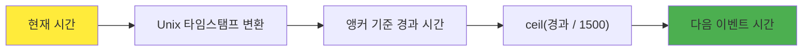
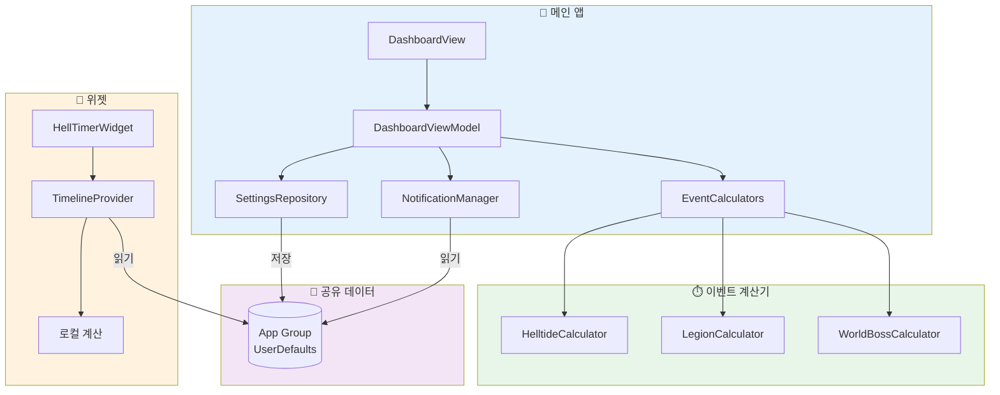
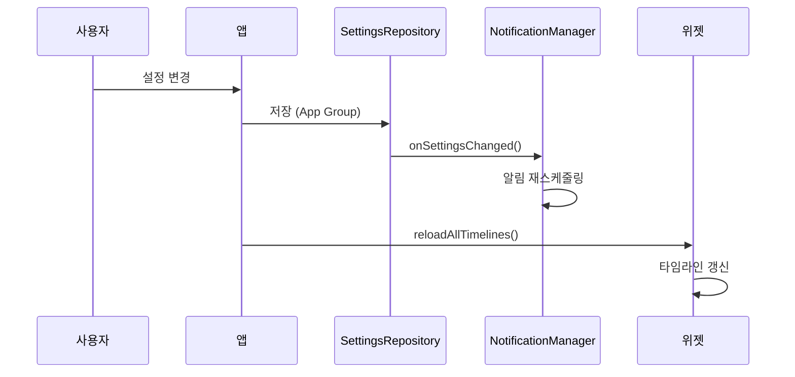
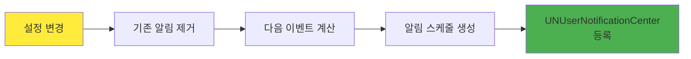

# Hell Timer - Diablo 4 이벤트 타이머

<div align="center">

[](https://swift.org/)
[](https://developer.apple.com/xcode/swiftui/)
[](https://www.apple.com/ios/)
[](https://developer.apple.com/widgets/)

**Diablo 4의 주요 이벤트 시간을 놓치지 마세요!**

[이벤트 규칙](#-이벤트-시간-규칙) | [기술 스택](#%EF%B8%8F-기술-스택) | [프로젝트 구조](#-프로젝트-구조) | [위젯](#-위젯-시스템)

</div>

---

## 프로젝트 소개

Hell Timer는 **Diablo 4의 주요 월드 이벤트 시간을 추적하는 iOS 앱**입니다.

지옥물결, 군단, 월드보스 세 가지 이벤트의 다음 시작 시간을 실시간으로 계산하고, 홈 화면 위젯과 푸시 알림으로 편리하게 확인할 수 있습니다.

### 주요 기능

- **실시간 타이머** - 세 가지 이벤트의 남은 시간 및 다음 시작 시간 표시
- **홈 화면 위젯** - 3가지 크기의 위젯으로 앱 실행 없이 확인
- **푸시 알림** - 이벤트 시작 전 알림 (1, 5, 10, 15, 30분 전)
- **오프라인 동작** - 네트워크 없이 100% 로컬 계산
- **글로벌 동기화** - UTC 기반으로 전 세계 동일한 시간 표시

---

## 이벤트 시간 규칙

Hell Timer는 세 가지 Diablo 4 월드 이벤트의 시간을 추적합니다. 각 이벤트는 고유한 주기와 계산 방식을 가지고 있습니다.

### 이벤트 비교 요약

| 이벤트 | 주기 | 계산 방식 | 특징 |
|:------:|:----:|:---------:|:----:|
| 지옥물결 | 60분 | 로컬 시간 | 매시 정각 시작 |
| 군단 | 25분 | UTC 앵커 | 전 세계 동기화 |
| 월드보스 | 105분 | UTC 앵커 | 하루 약 14회 |

---

### 1. 지옥물결 (Helltide)

지옥물결은 **가장 예측하기 쉬운 이벤트**입니다. 매 시간 정각에 시작하여 55분간 지속됩니다.

#### 규칙

| 항목 | 값 |
|:----:|:--:|
| 주기 | 60분 (1시간) |
| 활성 시간 | 00분 ~ 54분 (55분간) |
| 휴식 시간 | 55분 ~ 59분 (5분간) |
| 계산 기준 | 로컬 시간의 분(minute) |

#### 시간 사이클

```
┌─────────────────────────────────────────────────────────────┐
│  00:00                                    54:59   55:00  59:59
│    ├──────────── 활성 (55분) ──────────────┤├── 휴식 (5분) ──┤
│    🔥🔥🔥🔥🔥🔥🔥🔥🔥🔥🔥🔥🔥🔥🔥🔥🔥🔥🔥🔥🔥🔥🔥│     💤💤💤     │
└─────────────────────────────────────────────────────────────┘
```

#### 계산 로직

```swift
// HelltideCalculator.swift
func getCurrentStatus(at date: Date) -> HelltideEvent {
    let minutes = Calendar.current.component(.minute, from: date)

    if minutes < 55 {
        // 활성 상태 (0~54분)
        let remainingMinutes = 54 - minutes
        return HelltideEvent(isActive: true, remainingTime: remainingMinutes)
    } else {
        // 휴식 상태 (55~59분)
        return HelltideEvent(isActive: false, nextStart: 다음 정각)
    }
}
```

#### 예시

| 현재 시간 | 상태 | 남은 시간 |
|:---------:|:----:|:---------:|
| 14:30 | 활성 | 24분 30초 |
| 14:54 | 활성 | 0분 30초 |
| 14:57 | 휴식 | 다음 시작: 15:00 |

---

### 2. 군단 (Legion)

군단은 **25분 고정 주기**로 발생하며, UTC 기반의 글로벌 타임스탬프를 사용합니다.

#### 규칙

| 항목 | 값 |
|:----:|:--:|
| 주기 | 25분 (1,500초) |
| 앵커 타임스탬프 | 1,200초 (1970-01-01 00:20:00 UTC) |
| 활성 시간 | 이벤트 시작 후 약 4분 |
| 계산 기준 | Unix 타임스탬프 |

#### 계산 공식

```
다음 이벤트 시간 = 앵커 + ⌈(현재 - 앵커) / 주기⌉ × 주기
```



#### 계산 로직

```swift
// LegionCalculator.swift
static let anchorTimestamp: TimeInterval = 1200      // 고정 앵커
static let intervalSeconds: TimeInterval = 25 * 60   // 1500초

func calculateNextEventTime(from date: Date) -> Date {
    let currentTimestamp = date.timeIntervalSince1970
    let elapsed = currentTimestamp - Self.anchorTimestamp

    // ceil을 사용하여 다음 이벤트 시간 계산
    let cyclesPassed = ceil(elapsed / Self.intervalSeconds)
    let nextEventTimestamp = Self.anchorTimestamp + (cyclesPassed * Self.intervalSeconds)

    return Date(timeIntervalSince1970: nextEventTimestamp)
}
```

#### 앵커 타임스탬프란?

앵커 타임스탬프는 모든 이벤트 계산의 **기준점**입니다.

- **값**: 1,200초 = Unix epoch + 20분
- **의미**: 1970년 1월 1일 00:20:00 UTC
- **역할**: 이 시점을 기준으로 25분 간격으로 이벤트 발생

```
앵커 (1970-01-01 00:20 UTC)
  │
  ├── +25분 → 00:45
  ├── +50분 → 01:10
  ├── +75분 → 01:35
  │   ...
  └── +N×25분 → 현재 시간 근처의 다음 이벤트
```

---

### 3. 월드보스 (World Boss)

월드보스는 **105분(1시간 45분) 주기**로 스폰되며, 하루에 약 13-14회 등장합니다.

#### 규칙

| 항목 | 값 |
|:----:|:--:|
| 주기 | 105분 (6,300초) |
| 앵커 타임스탬프 | 1,767,702,600 (2026-01-06 12:30 UTC) |
| 일일 횟수 | 약 13-14회 |
| 계산 기준 | Unix 타임스탬프 |

#### 계산 공식

군단과 동일한 공식을 사용하며, 주기와 앵커만 다릅니다.

```
다음 이벤트 시간 = 앵커 + ⌈(현재 - 앵커) / 주기⌉ × 주기
```

#### 계산 로직

```swift
// WorldBossCalculator.swift
static let anchorTimestamp: TimeInterval = 1767702600  // 2026-01-06 12:30 UTC
static let intervalSeconds: TimeInterval = 105 * 60    // 6300초

func calculateNextEventTime(from date: Date) -> Date {
    let currentTimestamp = date.timeIntervalSince1970
    let elapsed = currentTimestamp - Self.anchorTimestamp

    let cyclesPassed = ceil(elapsed / Self.intervalSeconds)
    let nextEventTimestamp = Self.anchorTimestamp + (cyclesPassed * Self.intervalSeconds)

    return Date(timeIntervalSince1970: nextEventTimestamp)
}

// 하루 예상 횟수
static var estimatedDailyCount: Int {
    Int(ceil(24 * 60 / Double(intervalMinutes)))  // ≈ 14회
}
```

#### 일일 스케줄 예시

```
00:00 ─────┬─ 월드보스 #1
           │  (105분 후)
01:45 ─────┼─ 월드보스 #2
           │  (105분 후)
03:30 ─────┼─ 월드보스 #3
           │
    ...    │
           │
22:15 ─────┼─ 월드보스 #13
           │  (105분 후)
00:00 ─────┴─ 다음 날 첫 번째
```

---

## 기술 스택

<div align="center">

| 카테고리 | 기술 |
|:--------:|:----:|
| **언어** | Swift 5.9 |
| **UI 프레임워크** | SwiftUI |
| **위젯** | WidgetKit |
| **알림** | UserNotifications |
| **아키텍처** | MVVM |
| **데이터 공유** | App Group |
| **최소 지원** | iOS 16.4+ |

</div>

---

## 아키텍처



### 데이터 흐름



---

## 프로젝트 구조

```
helltimer/
├── 📂 helltimer/                          # 메인 앱 타겟
│   ├── 📄 helltimerApp.swift              # 앱 진입점
│   ├── 📂 Core/
│   │   ├── 📂 Models/
│   │   │   ├── 📄 GameEvent.swift         # 이벤트 프로토콜 및 구현체
│   │   │   ├── 📄 EventType.swift         # 이벤트 타입 열거형
│   │   │   └── 📄 UserSettings.swift      # 사용자 설정 모델
│   │   ├── 📂 Services/
│   │   │   ├── 📂 EventCalculators/
│   │   │   │   ├── 📄 HelltideCalculator.swift   # 지옥물결 계산
│   │   │   │   ├── 📄 LegionCalculator.swift     # 군단 계산
│   │   │   │   └── 📄 WorldBossCalculator.swift  # 월드보스 계산
│   │   │   ├── 📂 Notification/
│   │   │   │   └── 📄 NotificationManager.swift  # 알림 관리
│   │   │   └── 📄 SharedDataManager.swift        # 앱-위젯 데이터 동기화
│   │   └── 📂 Repositories/
│   │       └── 📄 SettingsRepository.swift       # 설정 저장소
│   └── 📂 Features/
│       ├── 📂 Dashboard/
│       │   ├── 📄 DashboardView.swift     # 메인 화면
│       │   ├── 📄 DashboardViewModel.swift
│       │   └── 📄 EventCardView.swift     # 이벤트 카드
│       └── 📂 Settings/
│           └── 📄 SettingsView.swift      # 설정 화면
│
├── 📂 HellTimerWidget/                    # 위젯 확장
│   ├── 📄 HellTimerWidget.swift           # 위젯 정의
│   ├── 📄 HellTimerWidgetProvider.swift   # 타임라인 제공자
│   ├── 📄 HellTimerWidgetEntry.swift      # 엔트리 모델
│   └── 📂 Views/
│       ├── 📄 SmallWidgetView.swift       # 1x1 위젯
│       ├── 📄 MediumWidgetView.swift      # 2x1 위젯
│       └── 📄 LargeWidgetView.swift       # 2x2 위젯
│
├── 📂 Shared/
│   └── 📄 AppGroupConstants.swift         # App Group 상수
│
└── 📂 docs/
    └── 📄 README.md                       # 이 문서
```

---

## 위젯 시스템

Hell Timer는 3가지 크기의 홈 화면 위젯을 제공합니다.

### 지원 크기

| 크기 | 이름 | 표시 내용 |
|:----:|:----:|:----------|
| **Small** | 1×1 | 가장 임박한 이벤트 1개 |
| **Medium** | 2×1 | 3개 이벤트 병렬 표시 |
| **Large** | 2×2 | 상세 정보 + 다음 일정 |

### 타임라인 갱신

```swift
// HellTimerWidgetProvider.swift
func timeline(for configuration: ConfigurationAppIntent, in context: Context) async -> Timeline<HellTimerWidgetEntry> {
    var entries: [HellTimerWidgetEntry] = []
    let currentDate = Date()

    // 1시간 동안 1분마다 엔트리 생성
    for minuteOffset in 0..<60 {
        let entryDate = Calendar.current.date(byAdding: .minute, value: minuteOffset, to: currentDate)!
        let entry = createEntry(for: configuration, date: entryDate)
        entries.append(entry)
    }

    // 1시간 후 타임라인 갱신
    let nextUpdate = Calendar.current.date(byAdding: .hour, value: 1, to: currentDate)!
    return Timeline(entries: entries, policy: .after(nextUpdate))
}
```

### 위젯 데이터 구조

```swift
struct HellTimerWidgetEntry: TimelineEntry {
    let date: Date
    let helltide: HelltideWidgetData
    let legion: LegionWidgetData
    let worldBoss: WorldBossWidgetData
    let configuration: ConfigurationAppIntent

    // 가장 임박한 이벤트 자동 계산
    var nextUpcomingEventType: WidgetEventType { ... }
}
```

---

## 알림 시스템

### 지원 알림 시간

| 옵션 | 설명 |
|:----:|:-----|
| 1분 전 | 급한 알림 |
| 5분 전 | 기본값 |
| 10분 전 | 여유 있는 준비 |
| 15분 전 | 충분한 준비 시간 |
| 30분 전 | 미리 계획 |

### 알림 설정

각 이벤트별로 독립적으로 알림을 설정할 수 있습니다.

```swift
struct UserSettings: Codable {
    var helltideNotificationEnabled: Bool = false
    var legionNotificationEnabled: Bool = false
    var worldBossNotificationEnabled: Bool = false
    var notificationMinutesBefore: [Int] = [5]  // 복수 선택 가능
}
```

### 알림 스케줄링



---

## App Group 데이터 공유

앱과 위젯 간 데이터 공유를 위해 App Group을 사용합니다.

```swift
// AppGroupConstants.swift
enum AppGroupConstants {
    static let suiteName = "group.com.izowooi.helltimer"

    enum Keys {
        static let userSettings = "userSettings"
        static let cachedEventData = "cachedEventData"
        static let lastWidgetUpdate = "lastWidgetUpdate"
    }
}
```

### 공유 데이터

| 키 | 타입 | 용도 |
|:---|:----:|:-----|
| `userSettings` | UserSettings | 알림 설정 |
| `cachedEventData` | WidgetEventData | 이벤트 캐시 |
| `lastWidgetUpdate` | Date | 마지막 업데이트 |

---

## 라이선스

이 프로젝트는 MIT 라이선스를 따릅니다.

---

## 만든 사람

**izowooi**

궁금한 점이나 제안사항이 있으시면 Issue를 남겨주세요!

---

<div align="center">

**지옥물결이 시작됩니다! 준비하세요!**

Made with ❤️ for Diablo 4 Players

</div>
